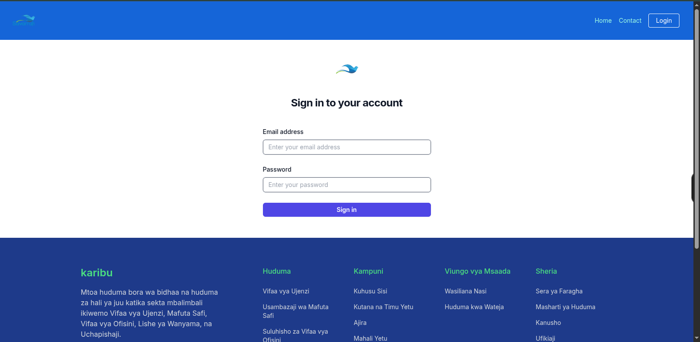
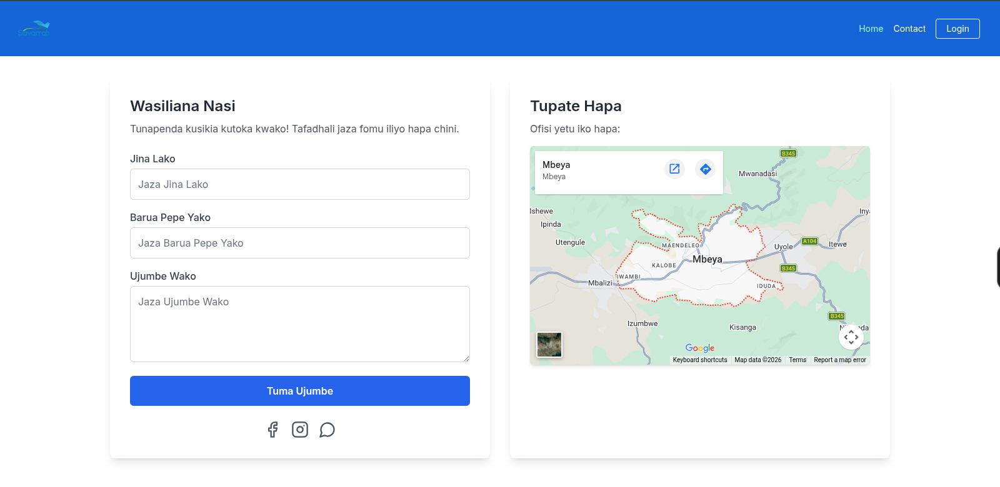
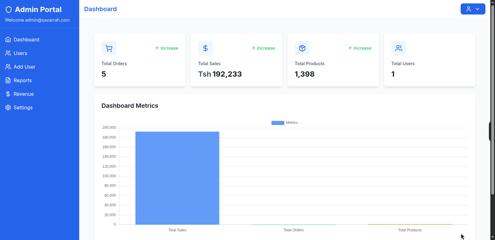
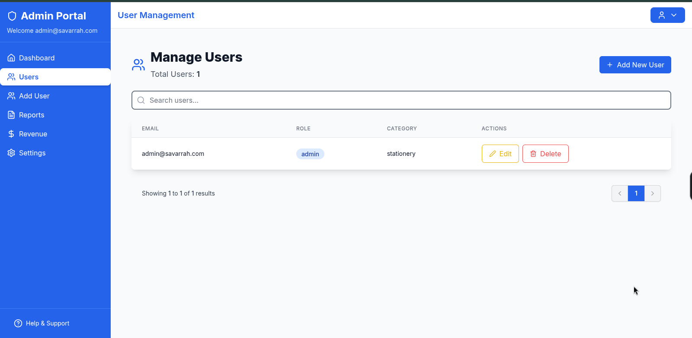
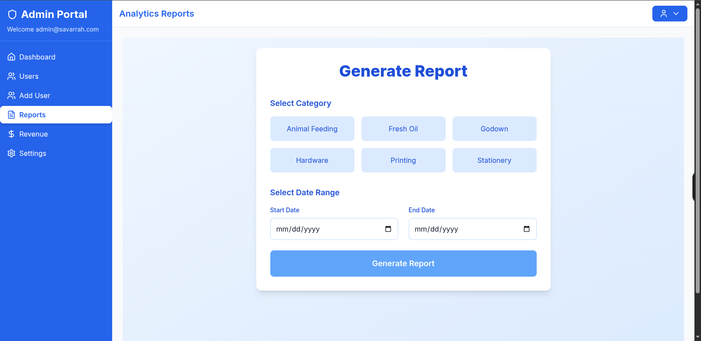

# Karibu — Company Management System

> An enterprise-grade, multi-module internal platform built end-to-end for Karibu Company Limited — covering inventory, sales, operations, reporting, and administration across six business lines.

Karibu is a full-stack production system designed to replace manual, spreadsheet-driven operations with a single source of truth for the company. It unifies six independent business divisions under one role-based admin platform with daily inventory movement, revenue and cost analytics, bulk data ingestion, and PDF reporting.

---

## Highlights

- **Full-stack ownership** — designed, built, and deployed the REST API, the React admin UI, and the public documentation site.
- **Six parallel business modules** (Animal Feeding, Fresh Oil, Godown, Hardware, Printing, Stationery) with consistent domain modeling — products, orders, inventory, revenue aggregation.
- **Role-based access control** with JWT authentication, permission middleware, and an automatic admin-bootstrap workflow.
- **Bulk data pipelines** — xlsx ingestion for godown inventory, multipart image uploads for product catalogues, daily-rotating audit logs.
- **Operational reporting** — revenue dashboards, cost dashboards, inventory movement logs, PDF report generation via PDFKit.
- **Design-system-driven frontend** — enterprise blue theme (Airtable + IBM inspired), centralized Tailwind tokens, responsive across mobile and desktop.
- **Documentation as a first-class deliverable** — every endpoint documented in MkDocs with method, auth, schema, and curl examples.

---

## Screenshots








---

## Tech Stack

| Layer    | Technologies                                                                                          |
| -------- | ----------------------------------------------------------------------------------------------------- |
| Backend  | Node.js, Express, MongoDB (Mongoose), JWT, Multer, PDFKit, Winston (daily rotation), Helmet, CORS, Rate Limit |
| Frontend | React 18, Vite, Tailwind CSS, React Router, React Hook Form, Axios, Chart.js, Framer Motion, Lucide   |
| Docs     | MkDocs, Markdown                                                                                      |
| Tooling  | ESLint, Mocha, Nodemon, Docker                                                                        |

---

## Architecture

```
karibu/
├── logic/      Node.js REST API     →  http://localhost:4100/api/v1
├── client/     React + Vite SPA     →  http://localhost:5173
└── docs/       MkDocs site          →  http://127.0.0.1:8000
```

Each business module follows a parallel structure across all three layers — `logic/routes/<module>.routes.js` ↔ `logic/controllers/` ↔ `logic/models/<module>/` ↔ `client/src/pages/<Module>/` ↔ `docs/docs/api/<module>.md` — making the codebase predictable to navigate and extend.

### API Surface (`/api/v1`)

| Module          | Endpoints | Capabilities                                                            |
| --------------- | --------: | ----------------------------------------------------------------------- |
| `users`         |         8 | Login, signup, admin bootstrap, CRUD, totals                            |
| `animal-feeding`|        16 | Products + orders CRUD, search, revenue, PDF reports                    |
| `fresh-oil`     |        19 | Paginated catalogue, sales aggregates, order/product counts             |
| `godown`        |        19 | xlsx bulk upload, inventory movement, movement-log CRUD                 |
| `hardware`      |        14 | Products + orders                                                       |
| `printing`      |         9 | Print job orders with status transitions                                |
| `stationery`    |        16 | Products + orders                                                       |

---

## Quick Start

**Prerequisites:** Node.js 18+, MongoDB, Python 3.

### Backend

```bash
cd logic
npm install
cp .env.example .env   # set MONGO_URI, JWT_SECRET, PORT (default 4100)
npm run dev
```

Server boots at `http://localhost:4100`. An admin user is provisioned automatically on first run.

### Frontend

```bash
cd client
npm install
npm run dev
```

Vite serves at `http://localhost:5173`. The SPA calls the backend at `http://localhost:4100`.

### Docs

```bash
cd docs
python -m venv .venv
source .venv/bin/activate
pip install -r requirements.txt
mkdocs serve
```

Available at `http://127.0.0.1:8000/`. Canonical deployed path: `/mysite/`.

---

## Engineering Practices

- **Strict domain modeling** — each module mirrors the same shape across routes, controllers, models, pages, and docs.
- **Centralized design tokens** — brand colors, typography, sidebar/topnav dimensions, and shadows are defined once in `tailwind.config.js` and referenced everywhere as `bg-primary`, `text-navy`, `w-sidebar`, etc.
- **Operational hygiene** — daily-rotating winston logs, helmet headers, CORS allow-lists, request rate limiting, and a documented backend-fix log (`docs/docs/backend-fixes.md`) tracking every bug found and how it was resolved.
- **Documentation discipline** — every endpoint has a corresponding MkDocs page with curl examples; the API reference is treated as part of the build, not an afterthought.
- **Minimal, focused changes** — no speculative abstractions, no backwards-compatibility shims, no half-finished work.

---

## Documentation

- API reference: `docs/docs/api/` (per-module)
- Backend fix log: `docs/docs/backend-fixes.md`
- Style guide: `docs/STYLE_GUIDE.md`
- Design system: `.claude/agents/AGENTS.md`
- Hosted docs: https://njoxpy.github.io/karibu/

---

## About the Author

Built and maintained by **NjoxPy** (Godbless Nyagawa) — full-stack engineer focused on shipping production internal tools.

- GitHub: [@njoxpy](https://github.com/njoxpy)

License: ISC.
